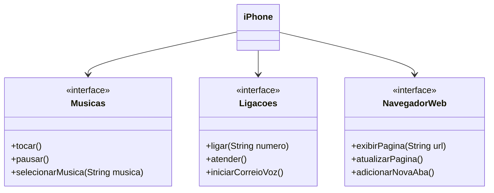

# diagrama-de-classes-b-sico-do-iphone-

```mermaid


classDiagram
   
   class NavegadorWeb{
         
         +exibirPagina(String url)
         +atualizarPagina()
         +adicionarNovaAba()
    }

<<interface>> NavegadorWeb

    class  Ligacoes{
         +ligar(String numero)
	     +atender()
	     +iniciarCorreioVoz()
   }
  <<interface>> Ligacoes
   class Musicas{
       +tocar()
	   +pausar()
	   +selecionarMusica(String musica)
   }
   <<interface>>Musicas

    class iPhone {
    }

    iPhone --> Musicas
    iPhone --> Ligacoes
    iPhone --> NavegadorWeb
```

